# FunWallet
FunWallet is a simple bitcoin and ethereum wallet example, shows the basic block chain wallet features:

* Bitcoin balance
* Receive bitcoin
* Transfer bitcoin
* Ethereum balance
* Transfer ethereum
* ERC20 token balance
* Transfer ERC20 token

# 简介
本文主要内容为区块链钱包移动端(Android)开发，介绍比特币钱包和以太坊钱包的开发过程，包含钱包的主要功能：
创建钱包，钱包余额，导出钱包，钱包转账等。[Demo地址](https://github.com/uncleleonfan/FunWallet)

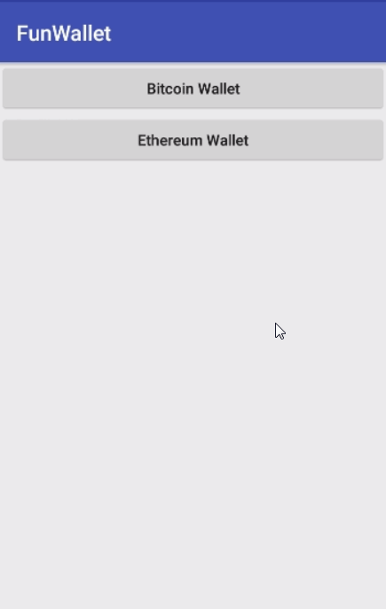

# 区块链钱包
在日常生活中，大家都会买个钱包用于存放政府机构发行的纸币，那么什么是数字资产世界的钱包呢？

[比特币钱包](https://bitcoin.org/en/choose-your-wallet)

以太坊钱包：[Mist](https://github.com/ethereum/mist/releases)、Parity、[MyEhterWallet](https://www.myetherwallet.com/)、ImToken、MetaTask、Ledger(硬件钱包)

* 助记词等价于私钥
* Keystore + 密码 等价于私钥

EOS钱包

NEO钱包

量子钱包

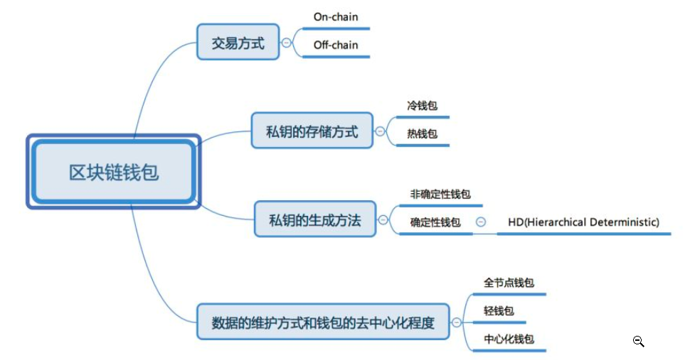

* On-chain

	给一个钱包地址发送数字货币, 这笔交易在全网广播、被确认、被打包进区块。这是发生在链上的，被称为on-chain交易。on-chain钱包需要自己保管私钥。

* Off-chain

	相对于on-chain交易是off-chain交易。通常，通过交易所进行的交易是off-chain的，本人并没有私钥。私钥在交易所，由交易所托管。所以交易所的钱包也是中心化的钱包。
交易所：[币安](https://www.binance.com/cn)、[火币]()、币系、Gate等

* 冷钱包

	冷即离线、断网，也就是说私钥存储的位置不能被网络所访问。例如纸钱包、脑钱包、硬件钱包等等。

	

* 热钱包

	热即联网，也就是私钥存储在能被网络访问的位置。 例如存放在交易所的、在线钱包网站、手机App钱包都属于热钱包。通常而言，冷钱包更加安全，热钱包使用更加方便。

* 非确定性钱包
	钱包随机生成

* 确定性钱包（HD Wallets）
	同一个种子，能够派生一样的密钥对集合

* 全节点钱包

	除了保存私钥外，全节点钱包还有保存了所有区块的数据，最为著名的是bitcoin-core。

* 轻钱包

	它不必保存所有区块的数据，只保存跟自己相关的数据。基本可以实现去中心化。
* 中心化钱包

	在交易所中的钱包，以及类似 OKLink 提供的保险柜服务。

# 比特币钱包
[https://bitcoin.org/en/developer-guide#wallets](https://bitcoin.org/en/developer-guide#wallets)

* 比特币钱包的组成
* 比特币钱包地址的创建过程
* BIP32
* BIP39
* BIP43
* BIP44
* BitcoinJ创建钱包
* Bitcoin钱包收款和转账

## 比特币钱包组成
比特币钱包分为两部分：钱包程序和钱包文件

### 钱包文件
保存私钥和转账记录

    Wallet containing 0.01 BTC (spendable: 0.01 BTC) in:
      0 pending transactions
      1 unspent transactions
      0 spent transactions
      0 dead transactions
    Last seen best block: 1384907 (2018-08-22T03:38:42Z): 0000000000000030fe01a48a7cd6b0c52909a7d019084d195ae3ebd2889c82ec

    Keys:
    Earliest creation time: 2018-08-20T07:51:29Z
    Seed birthday: 1534751489  [2018-08-20T07:51:29Z]
    Key to watch:  tpubD92y4mcSrbcSxANfCgiWx7h7sGquSF4ogNPcUxC2GECSwgWBMNPMo2C8nxez2ngvSS4UfaGhSunemWoqZ6aAAzLb4WLsmQxDirfFgE9tG5J
      addr:mq5gdvJDuDEmNKFPbgMn8pGm3pyJvkSsHv  hash160:68e9c9e06890527cd0f0b59d83333502ac127bef  (M/0H/0/0)

    >>> UNSPENT:
    0.01 BTC total value (sends 0.00 BTC and receives 0.01 BTC)
      confidence: Seen by 7 peers (most recently: 2018-08-22T03:33:33Z). Appeared in best chain at height 1384907, depth 1. Source: NETWORK
      a82c35c2133bd357bfa462f82d75b28787afcdcd20c8b89cd2b78f48138d6e9f
      updated: 2018-08-22T03:31:53Z
         in   PUSHDATA(71)[304402205d3e0974b4604b92e09f83950b183100bd47243c9cb548f2213a9ca26e83bdd3022018278c7ce9b65982e6c67ba9acf8e6e3898f1dad80702bb1e32c4a0b61195e0f01] PUSHDATA(33)[02f8769ecddd821cc9b75c554978b4a674df28c098e640fd0188b88bf019bc31fa]
              outpoint:8294b8dcf6513ab13321d4dd1642bf1c19600a313bf1ebe8511521dcd4dd0277:0
         out  DUP HASH160 PUSHDATA(20)[8843beff2291c5a00aa00fbd8a541f800c83b86d] EQUALVERIFY CHECKSIG 1.1899548 BTC
         out  DUP HASH160 PUSHDATA(20)[68e9c9e06890527cd0f0b59d83333502ac127bef] EQUALVERIFY CHECKSIG 0.01 BTC
         prps UNKNOWN
         ##  ##

### 钱包程序
钱包程序，创建公钥来接受satoshi，使用私钥来使用satoshi。钱包程序可以拆分出3个独立的模块：公钥分发模块、签名模块、网络模块

     比特币单位:
     1比特币（Bitcoins，BTC）
     0.01比特分（Bitcent，cBTC）
     0.001毫比特（Milli-Bitcoins，mBTC）
     0.000001微比特（Micro-Bitcoins，μBTC或uBTC）
     0.00000001聪（satoshi）（基本单位）
     1 bitcoin (BTC) = 1000 millibitcoins (mBTC) = 1 million microbitcoins (uBTC) = 100 million Satoshi

根据三个模块的组合，可以分为全服务钱包、只签名钱包（离线钱包和硬件钱包）、只分发钱包。

全服务钱包:

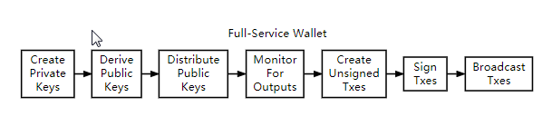

只签名钱包：
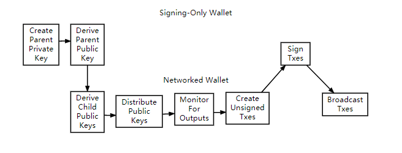

只分发钱包：

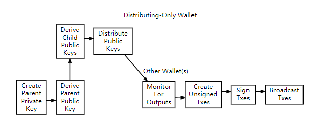

## BIP协议
[Bitcoin Improvement Proposals](https://github.com/bitcoin/bips)

### BIP32
[BIP32](https://github.com/bitcoin/bips/blob/master/bip-0032.mediawiki)：定义了层级确定性钱包（hierarchical deterministic wallets），是一个系统可以从单一个 seed 产生一树状结构储存多组 keypairs（私钥和公钥）。好处是可以方便的备份、转移到其他相容装置（因为都只需要 seed），以及分层的权限控制等。
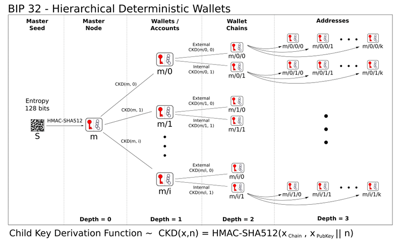

作用：

* 1、备份更容易。按照比特币的原则，尽量不要不要使用同一个地址，一个地址只使用一次，这样会导致频繁备份钱包。HD钱包只需要在创建时保存主密钥，通过主密钥可以派生出所有的子密钥。

* 2、私钥离线更安全。主私钥离线存储，主公钥在线使用，通过主公钥可以派生出所有的子公钥。例如：给每个商品提供一个收款地址。
* 3、利于管理，权限控制。树状结构类似于公司的组织架构，可以给各个部门指定一个密钥分支。
* 4、记账。只使用公钥即可记账。

### BIP39
[BIP39](https://github.com/bitcoin/bips/blob/master/bip-0039.mediawiki)：将seed 用方便记忆和书写的单字表示。一般由 12 个单字组成，称为 mnemonic code(phrase)，中文称为助记词或助记码。例如：
average green proud remember advance trick estate oblige trouble when cube person

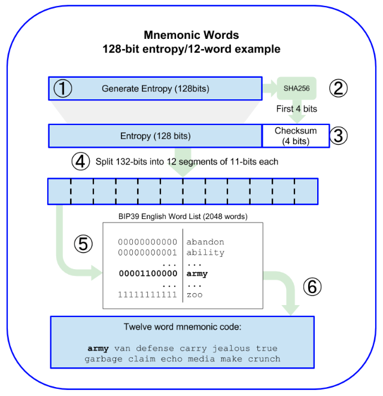
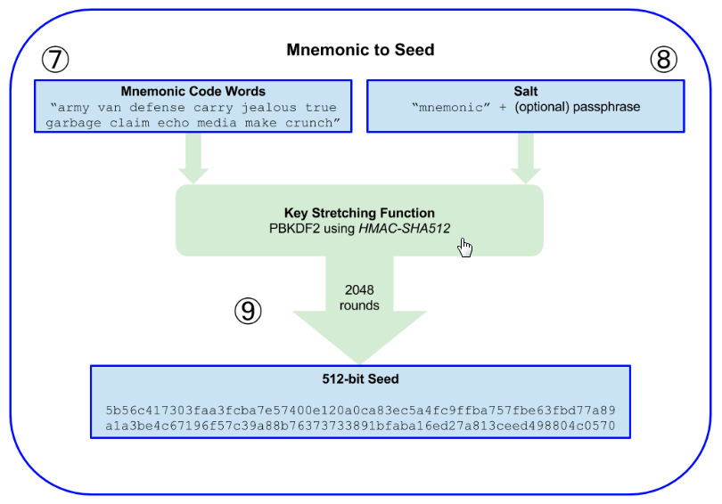

[Wordlists](https://github.com/bitcoin/bips/blob/master/bip-0039/bip-0039-wordlists.md)

[工具](https://iancoleman.io/bip39/)

### BIP43
[BIP43](https://github.com/bitcoin/bips/blob/master/bip-0043.mediawiki)

BIP43对BIP32树结构增加了子索引标识purpose的拓展m/purpose'/*

BIP32的索引：m/0'/*

BIP44的索引：m/44'/*。

### BIP44
[BIP44](https://github.com/bitcoin/bips/blob/master/bip-0044.mediawiki)：基于BIP32和BIP43，赋予树状结构中的各层特殊的意义。让同一个 seed 可以支援多币种、多帐户等。各层定义如下：

    m / purpose' / coin_type' / account' / change / address_index

* purporse': 固定值44', 代表是BIP44
* coin_type': 这个代表的是币种, 可以兼容很多种币, 比如BTC是0', ETH是60', 例如：btc一般是 m/44'/0'/0'/0, eth一般是 m/44'/60'/0'/0
* account'：账号
* change': 0表示外部链（External Chain），用户接收比特币，1表示内部链（Internal Chain）,用于接收找零
* address_index：钱包索引

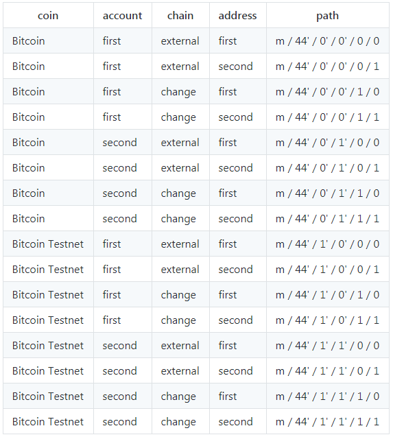

### 钱包最佳实践
* 使用助记词（BIP39）
* 使用层级确定性钱包（HD Wallets）（BIP32）
* 使用多目的HD Wallets（BIP43）
* 使用多币种，多账号的HD Wallets (BIP44)

## 比特币钱包地址创建过程
1、生成128bit~256bit作为私钥

2、通过[secp256k1](http://www.secg.org/sec2-v2.pdf)椭圆曲线算法得到私钥对应的公钥

3、将公钥进行SHA-256，得到公钥Hash

4、将3的结果进行RIMEMD-160

5、将4中结果添加1个字节版本号

6、将5中结果进行两次SHA-256，取前4个字节作为checksum

7、将6中结果添加到5中结果的末尾

8、将7中结果进行Base58，结果为比特币地址

## BitcoinJ创建钱包
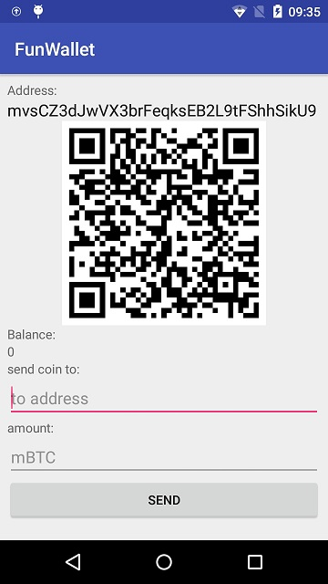

[Bitcoinj](https://github.com/bitcoinj/bitcoinj)是比特币协议Java版本实现的库。

添加依赖：

	dependencies {
	    implementation 'org.bitcoinj:bitcoinj-core:0.14.7'
	    implementation 'org.slf4j:slf4j-api:1.7.25'
	    implementation 'com.squareup.okhttp3:okhttp:3.10.0'
	    implementation 'com.squareup.okhttp3:logging-interceptor:3.10.0'
	    implementation 'com.google.zxing:core:3.3.3'//二维码
	}

Android最大方法数的限制，60K
开启multiDexEnabled

	android {
	    compileSdkVersion 28
	    defaultConfig {
	        multiDexEnabled true
	    }
	}

	dependencies {
	    implementation 'com.android.support:multidex:1.0.3'
	}

### 创建新钱包

	File walletFile = activity.getFileStreamPath("wallet-protobuf");
    //创建钱包
    wallet = new Wallet(Constants.NETWORK_PARAMETERS);
    //创建WalletFiles，设置自动保存Wallet
    WalletFiles walletFiles = wallet.autosaveToFile(walletFile, 3 * 1000, TimeUnit.MILLISECONDS, null);
    //立即保存
    walletFiles.saveNow();

钱包创建源码分析:

* Wallet
* KeyChainGroup
* DeterministicKeyChain
* DeterministicSeed

	    protected DeterministicKeyChain(DeterministicSeed seed, @Nullable KeyCrypter crypter) {
	        this.seed = seed;
	        basicKeyChain = new BasicKeyChain(crypter);
	        if (!seed.isEncrypted()) {
	            rootKey = HDKeyDerivation.createMasterPrivateKey(checkNotNull(seed.getSeedBytes()));
	            rootKey.setCreationTimeSeconds(seed.getCreationTimeSeconds());
	            addToBasicChain(rootKey);
	            hierarchy = new DeterministicHierarchy(rootKey);
	            for (int i = 1; i <= getAccountPath().size(); i++) {
	                addToBasicChain(hierarchy.get(getAccountPath().subList(0, i), false, true));
	            }
	            initializeHierarchyUnencrypted(rootKey);
	        }
	        // Else...
	        // We can't initialize ourselves with just an encrypted seed, so we expected deserialization code to do the
	        // rest of the setup (loading the root key).
	    }

### 获取钱包地址

    Address address = wallet.currentAddress(KeyChain.KeyPurpose.RECEIVE_FUNDS);
    address.toString();

在获取地址的过程中会调用RIMEMD-160算法处理公钥hash:

	//Utils.java
    public static byte[] sha256hash160(byte[] input) {
        byte[] sha256 = Sha256Hash.hash(input);
        RIPEMD160Digest digest = new RIPEMD160Digest();
        digest.update(sha256, 0, sha256.length);
        byte[] out = new byte[20];
        digest.doFinal(out, 0);
        return out;
    }

处理公钥hash后会进行Base58算法：

	//VersionedChecksummedBytes.java
    public final String toBase58() {
        // A stringified buffer is:
        //   1 byte version + data bytes + 4 bytes check code (a truncated hash)
        byte[] addressBytes = new byte[1 + bytes.length + 4];
        addressBytes[0] = (byte) version;
        System.arraycopy(bytes, 0, addressBytes, 1, bytes.length);
        byte[] checksum = Sha256Hash.hashTwice(addressBytes, 0, bytes.length + 1);
        System.arraycopy(checksum, 0, addressBytes, bytes.length + 1, 4);
        return Base58.encode(addressBytes);
    }

### 从文件中加载钱包

    //读取钱包文件
    File walletFile = activity.getFileStreamPath("wallet-protobuf");
    if (walletFile.exists()) {
        InputStream inputStream = new FileInputStream(walletFile);
        //反序列化
        wallet  = new WalletProtobufSerializer().readWallet(inputStream);
        //设置自动保存
        wallet.autosaveToFile(walletFile, 3 * 1000, TimeUnit.MILLISECONDS, null);
        //清理钱包
        wallet.cleanup();
    }

### 创建地址二维码

    String s = BitcoinURI.convertToBitcoinURI(address, null, null, null);
    Bitmap bitmap = Qr.bitmap(s);
    BitmapDrawable bitmapDrawable = new BitmapDrawable(getResources(), bitmap);
    bitmapDrawable.setFilterBitmap(false);
    mQrImageView.setImageDrawable(bitmapDrawable);

    public static Bitmap bitmap(final String content) {
        try {
            final Hashtable<EncodeHintType, Object> hints = new Hashtable<EncodeHintType, Object>();
            hints.put(EncodeHintType.MARGIN, 0);
            hints.put(EncodeHintType.ERROR_CORRECTION, ErrorCorrectionLevel.H);
            final BitMatrix result = QR_CODE_WRITER.encode(content, BarcodeFormat.QR_CODE, 0, 0, hints);

            final int width = result.getWidth();
            final int height = result.getHeight();
            final byte[] pixels = new byte[width * height];

            for (int y = 0; y < height; y++) {
                final int offset = y * width;
                for (int x = 0; x < width; x++) {
                    pixels[offset + x] = (byte) (result.get(x, y) ? -1 : 0);
                }
            }

            final Bitmap bitmap = Bitmap.createBitmap(width, height, Bitmap.Config.ALPHA_8);
            bitmap.copyPixelsFromBuffer(ByteBuffer.wrap(pixels));
            return bitmap;
        } catch (final WriterException x) {
            log.info("problem creating qr code", x);
            return null;
        }
    }

## Bitcoin钱包收款和转账
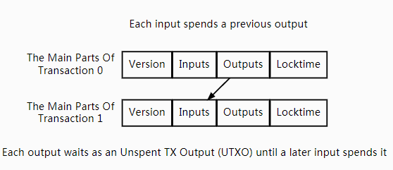

比特币钱包余额需要统计所有钱包地址对应的UTXO

Simplified Payment Verification (SPV):节点无需下载所有的区块数据，而只需要加载所有区块头数据（block header的大小为80B），即可验证这笔交易是否曾经被比特币网络认证过。

布隆过滤器（Bloom Filter)：过滤掉那些不包含有目标地址的交易信息，这一步能避免掉大量不相关的数据下载。

### 创建区块链

    //创建区块链文件
    File blockChainFile = new File(getDir("blockstore", Context.MODE_PRIVATE), "blockchain");
    //创建SPVBlockStore，管理区块数据
    blockStore = new SPVBlockStore(Constants.NETWORK_PARAMETERS, blockChainFile);
    //加载检查点
    final InputStream checkpointsInputStream = getAssets().open("checkpoints-testnet.txt");
    CheckpointManager.checkpoint(Constants.NETWORK_PARAMETERS, checkpointsInputStream,
                            blockStore, earliestKeyCreationTime);
    //创建区块链对象
    blockChain = new BlockChain(Constants.NETWORK_PARAMETERS, wallet, blockStore);

### 同步区块链

	//添加网络权限：
	<uses-permission android:name="android.permission.INTERNET"/>

    private void startup() {
        Log.d(TAG, "startup: ");
        peerGroup = new PeerGroup(Constants.NETWORK_PARAMETERS, blockChain);
        peerGroup.setDownloadTxDependencies(0); // recursive implementation causes StackOverflowError
        peerGroup.addWallet(wallet);//设置钱包，重要
        try {
            PackageInfo packageInfo = getPackageManager().getPackageInfo(getPackageName(), PackageManager.GET_ACTIVITIES);
            peerGroup.setUserAgent(USER_AGENT, packageInfo.versionName);
        } catch (PackageManager.NameNotFoundException e) {
            e.printStackTrace();
        }
        peerGroup.setMaxConnections(8);
        int connectTimeout = (int) (15 * DateUtils.SECOND_IN_MILLIS);
        peerGroup.setConnectTimeoutMillis(connectTimeout);
        int discoveryTimeout = (int) (10 * DateUtils.SECOND_IN_MILLIS);
        peerGroup.addConnectedEventListener(mPeerConnectedEventListener);
        peerGroup.addDisconnectedEventListener(mPeerDisconnectedEventListener);
        peerGroup.addDiscoveredEventListener(mPeerDiscoveredEventListener);
        peerGroup.setPeerDiscoveryTimeoutMillis(discoveryTimeout);

		//添加节点探索器，重要
        peerGroup.addPeerDiscovery(new PeerDiscovery() {
            private final PeerDiscovery normalPeerDiscovery = MultiplexingDiscovery
                    .forServices(Constants.NETWORK_PARAMETERS, 0);

            @Override
            public InetSocketAddress[] getPeers(final long services, final long timeoutValue,
                                                final TimeUnit timeoutUnit) throws PeerDiscoveryException {
                return normalPeerDiscovery.getPeers(services, timeoutValue, timeoutUnit);
            }

            @Override
            public void shutdown() {
                normalPeerDiscovery.shutdown();
            }
        });
        peerGroup.startAsync();
        peerGroup.startBlockChainDownload(null);
    }

### 比特币收款
获取测试用比特币：[https://testnet.manu.backend.hamburg/faucet](https://testnet.manu.backend.hamburg/faucet)
刚收到的币可能需要几分钟后才能使用

    //监听比特币接受事件
    wallet.addCoinsReceivedEventListener(mWalletListener);
    //刷新余额
    Coin balance = wallet.getBalance(Wallet.BalanceType.ESTIMATED);

### 比特币转账
[比特币测试链转账查询](https://live.blockcypher.com/btc-testnet/#)
创建一个Tx，对Tx进行签名，对Tx进行P2P网络广播

	Address address = Address.fromBase58(Constants.NETWORK_PARAMETERS, to);
    //转账金额，以mBTC为单位
    Coin coin = MonetaryFormat.MBTC.parse(amount);
    //创建请求
    SendRequest sendRequest = SendRequest.to(address, coin);
    try {
        //创建Transaction
        Transaction transaction = wallet.sendCoinsOffline(sendRequest);
        //通过P2P广播
        BlockChainService.broadcastTransaction(BitcoinWalletActivity.this, transaction);
    } catch (InsufficientMoneyException e) {
        Toast.makeText(this, e.getLocalizedMessage(), Toast.LENGTH_SHORT).show();
        e.printStackTrace();
    }

    public static void broadcastTransaction(Context context, Transaction transaction) {
        Intent intent = new Intent(ACTION_BROADCAST_TRANSACTION, null, context, BlockChainService.class);
        intent.putExtra(ACTION_BROADCAST_TRANSACTION_HASH, transaction.getHash().getBytes());
        context.startService(intent);
    }

    @Override
    public int onStartCommand(Intent intent, int flags, int startId) {
        Log.d(TAG, "onStartCommand: ");
        if (intent != null) {
            byte[] txHash = intent.getByteArrayExtra("tx");
            if (txHash != null) {
                Sha256Hash sha256Hash = Sha256Hash.wrap(txHash);
                Transaction transaction = BitcoinWalletManager.getInstance().getWallet().getTransaction(sha256Hash);
                peerGroup.broadcastTransaction(transaction);
                Log.d(TAG, "onStartCommand: " + sha256Hash.toString());
            }
        }
        return super.onStartCommand(intent, flags, startId);
    }

# 以太坊钱包
[https://github.com/ethereumbook/ethereumbook/blob/develop/wallets.asciidoc](https://github.com/ethereumbook/ethereumbook/blob/develop/wallets.asciidoc)

以太坊钱包功能与比特币钱包功能类似，获取用户余额，管理地址和密钥，转账、智能合约调用。以太坊钱包一般不用在本地维护区块链数据，只需要使用JSON-RPC访问

## 钱包文件

KeyStore = 私钥 + 密码

如果使用ImToken创建钱包，创建了助记词，密码用来加密钱包地址对应的子私钥，加密的结果就是Keystore.

    {
        "address": "001d3f1ef827552ae1114027bd3ecf1f086ba0f9",
        "crypto": {
            "cipher": "aes-128-ctr",
            "ciphertext": "233a9f4d236ed0c13394b504b6da5df02587c8bf1ad8946f6f2b58f055507ece",
            "cipherparams": {
                "iv": "d10c6ec5bae81b6cb9144de81037fa15"
            },
            "kdf": "scrypt",
            "kdfparams": {
                "dklen": 32,
                "n": 262144,
                "p": 1,
                "r": 8,
                "salt": "99d37a47c7c9429c66976f643f386a61b78b97f3246adca89abe4245d2788407"
            },
            "mac": "594c8df1c8ee0ded8255a50caf07e8c12061fd859f4b7c76ab704b17c957e842"
        },
        "id": "4fcb2ba4-ccdb-424f-89d5-26cce304bf9c",
        "version": 3
    }

## 以太坊钱包地址创建过程
1、使用Secp256k1创建公私钥

2、通过Keccak算法得到公钥Hash值，进而得到长度为40的地址字符串

3、一般的，会在地址字符串签名加前缀"0x"

## Web3j创建钱包
[Web3j](https://web3j.io/)

添加Web3j依赖

    implementation 'org.web3j:core:3.3.1-android'

### 创建新钱包
这里不涉及BIP协议，为非确定性钱包

Wallet.createStandard() 出现OOM, Out of Memory
https://juejin.im/post/5b4b07f8e51d45199060fe1f

    File walletDir = contextWrapper.getDir("eth", Context.MODE_PRIVATE);
 	//生成密钥对
    ECKeyPair ecKeyPair = Keys.createEcKeyPair();
	//WalletFile = KeyStore
    WalletFile wallet = Wallet.createLight(PASSWORD, ecKeyPair);
    String walletFileName = getWalletFileName(wallet);
    File destination = new File(walletDir, walletFileName);
    objectMapper.writeValue(destination, wallet);

### 加载钱包文件

    File[] files = walletDir.listFiles();
    wallet = objectMapper.readValue(files[0], WalletFile.class);

### 通过助记词创建钱包
涉及BIP协议，但没有遵循bitcoin地址只使用一次的原则，钱包一般只使用派生出来第一个地址

可通过[工具](https://iancoleman.io/bip39/)检查派生的地址是否正确

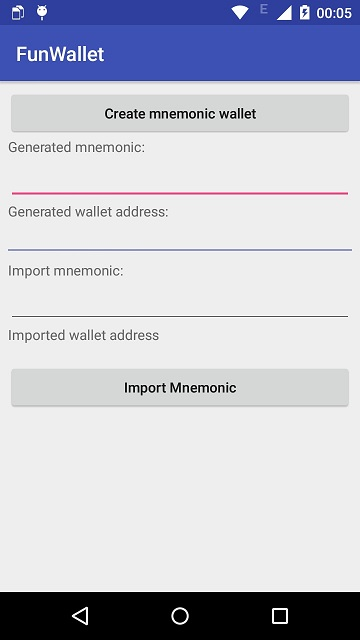

    //创建助记词
    public List<String> createMnemonics() throws MnemonicException.MnemonicLengthException {
        SecureRandom secureRandom = new SecureRandom();
        byte[] entropy = new byte[DeterministicSeed.DEFAULT_SEED_ENTROPY_BITS / 8];
        secureRandom.nextBytes(entropy);
        return  MnemonicCode.INSTANCE.toMnemonic(entropy);
    }

    //m / 44' / 60' / 0' / 0
	//Hardened意思就是派生加固，防止获取到一个子私钥之后可以派生出后面的子私钥
	//必须还有上一级的父私钥才能派生
    public static final ImmutableList<ChildNumber> BIP44_ETH_ACCOUNT_ZERO_PATH =
            ImmutableList.of(new ChildNumber(44, true), new ChildNumber(60, true),
                    ChildNumber.ZERO_HARDENED, ChildNumber.ZERO);

    //通过助记词生成HD钱包
    public void onCreateWallet(View view) {

        byte[] seed = MnemonicCode.toSeed(words, "");
        DeterministicKey masterPrivateKey = HDKeyDerivation.createMasterPrivateKey(seed);
        DeterministicHierarchy deterministicHierarchy = new DeterministicHierarchy(masterPrivateKey);
        // m / 44' / 60' / 0' / 0 / 0
        DeterministicKey deterministicKey = deterministicHierarchy
                .deriveChild(BIP44_ETH_ACCOUNT_ZERO_PATH, false, true, new ChildNumber(0));
        byte[] bytes = deterministicKey.getPrivKeyBytes();
        ECKeyPair keyPair = ECKeyPair.create(bytes);
        try {
            WalletFile walletFile = Wallet.createLight(PASSWORD, keyPair);
            String address = walletFile.getAddress();
            mAddress.setText("0x" + address);
        } catch (CipherException e) {
            e.printStackTrace();
        }
    }

## 导出钱包

### 导出KeyStore

    public String exportKeyStore(WalletFile wallet) {
        try {
            return objectMapper.writeValueAsString(wallet);
        } catch (JsonProcessingException e) {
            e.printStackTrace();
        }
        return null;
    }

### 导出私钥
    public String exportPrivateKey(WalletFile wallet) {
        try {
            ECKeyPair ecKeyPair = Wallet.decrypt(PASSWORD, wallet);
            BigInteger privateKey = ecKeyPair.getPrivateKey();
            return  Numeric.toHexStringNoPrefixZeroPadded(privateKey, Keys.PRIVATE_KEY_LENGTH_IN_HEX);
        } catch (CipherException e) {
            e.printStackTrace();
        }
        return null;
    }

### 导出助记词
一般可以将助记词加密存储，导出时解密。注意无法从KeyStore或者私钥导出助记词。

例如：使用IMToken导入私钥或者KeyStore创建的钱包，没有导出助记词的功能
如果是通过助记词创建的，就会有导出助记词的功能

## ETH交易

[获取Robsten测试网络ETH](https://faucet.ropsten.be/)

### 查询余额

    private Web3j mWeb3j = Web3jFactory.build(new HttpService("https://ropsten.infura.io/1UoO4I/"));
    BigInteger balance = mWeb3j.ethGetBalance(mAddress, DefaultBlockParameterName.LATEST).send().getBalance();
    BigDecimal balance = Convert.fromWei(balance.toString(), Convert.Unit.ETHER);

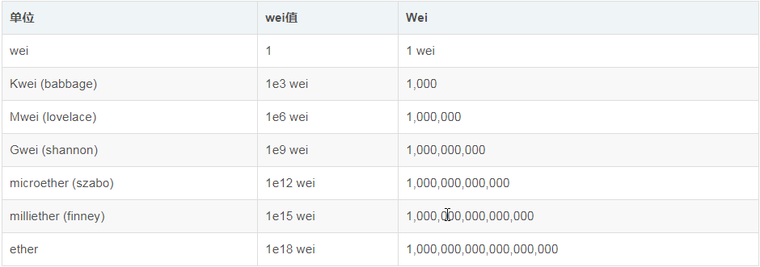

### ETH转账
[转账记录查询](https://ropsten.etherscan.io/)

    BigInteger transactionCount = mWeb3j.ethGetTransactionCount(mAddress, DefaultBlockParameterName.LATEST).send().getTransactionCount();
    BigInteger gasPrice = mWeb3j.ethGasPrice().send().getGasPrice();
    BigInteger gasLimit = new BigInteger("200000");
    BigDecimal value = Convert.toWei(mAmountEdit.getText().toString().trim(), Convert.Unit.ETHER);
    String to = mToAddressEdit.getText().toString().trim();
    RawTransaction etherTransaction = RawTransaction.createEtherTransaction(transactionCount, gasPrice, gasLimit, to, value.toBigInteger());
    ECKeyPair ecKeyPair = Wallet.decrypt("a12345678", mWalletFile);
    Credentials credentials = Credentials.create(ecKeyPair);
    byte[] bytes = TransactionEncoder.signMessage(etherTransaction, credentials);
    String hexValue = Numeric.toHexString(bytes);
    String transactionHash = mWeb3j.ethSendRawTransaction(hexValue).send().getTransactionHash();

## Token交易

### 获取某Token余额
调用ERC20代币智能合约，获取当前地址的余额

    //创建Function
    private Function balanceOf(String owner) {
        return new Function("balanceOf",
                Collections.singletonList(new Address(owner)),
                Collections.singletonList(new TypeReference<Uint256>(){}));
    }

    Function function = balanceOf(mAddress);
    //调用智能合约
    String s = callSmartContractFunction(function, CONTRACT_ADDRESS);
    List<Type> decode = FunctionReturnDecoder.decode(s, function.getOutputParameters());
    if (decode != null && decode.size() > 0) {
        Uint256 type = (Uint256) decode.get(0);
        BigInteger tokenBalance = type.getValue();
    }

    private String callSmartContractFunction(
            Function function, String contractAddress) throws Exception {
        String encodedFunction = FunctionEncoder.encode(function);

        org.web3j.protocol.core.methods.response.EthCall response = mWeb3j.ethCall(
                Transaction.createEthCallTransaction(
                        mAddress, contractAddress, encodedFunction),
                DefaultBlockParameterName.LATEST)
                .sendAsync().get();

        return response.getValue();
    }

### Token转账

    //创建Function
    private Function transfer(String to, BigInteger value) {
        return new Function(
                "transfer",
                Arrays.asList(new Address(to), new Uint256(value)),
                Collections.singletonList(new TypeReference<Bool>() {}));
    }

    Function transfer = transfer(to, new BigInteger(amount));
    //获取私钥，进行签名
    ECKeyPair ecKeyPair = Wallet.decrypt("a12345678", mWalletFile);
    Credentials credentials = Credentials.create(ecKeyPair);
    String transactionHash = execute(credentials, transfer, CONTRACT_ADDRESS);

    //执行合约调用
    private String execute(
            Credentials credentials, Function function, String contractAddress) throws Exception {
        BigInteger nonce =  mWeb3j.ethGetTransactionCount(mAddress, DefaultBlockParameterName.LATEST).send().getTransactionCount();
        BigInteger gasPrice = mWeb3j.ethGasPrice().send().getGasPrice();
        BigInteger gasLimit = new BigInteger("200000");
        String encodedFunction = FunctionEncoder.encode(function);

        RawTransaction rawTransaction = RawTransaction.createTransaction(
                nonce,
                gasPrice,
                gasLimit,
                contractAddress,
                encodedFunction);

        byte[] signedMessage = TransactionEncoder.signMessage(rawTransaction, credentials);
        String hexValue = Numeric.toHexString(signedMessage);

        EthSendTransaction transactionResponse = mWeb3j.ethSendRawTransaction(hexValue)
                .sendAsync().get();

        return transactionResponse.getTransactionHash();
    }

